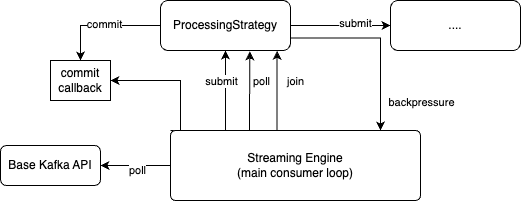

===================
Arroyo Architecture
===================

Arroyo is a set of high level abstractions to interact with Kafka.
These are meant to help the developer in writing performant consumers with
specific delivery guarantees.

Common problems addressed by Arroyo are guaranteeing at-least-once delivery,
providing a dead letter queue abstraction, support parallel (multi-processing)
message processing, etc.

The library is divided in three layers: the basic Kafka connectivity, the
streaming engine and the high level abstractions.

The basic connectivity layer is a simply wrapper around the Confluent python
library, which is itself based on librdkafka. Besides some cosmetic changes,
this level provides a Fake in memory broker and consumer to make unit test quick
to run.

The streaming engine provides an asynchronous processing interface to write
consumers. The consumer is written as a pipeline where each segment is an
asynchronous operation. The streaming engine implements the main consumer loop
and delgates the processing to the pipeline.

On top of the streaming engine, the library provides high level abstractions that
are common when writing Kafka consumers like: *map*, *reduce*, *filter* together
with some common messaging application patterns like the dead letter queue.

Streaming Interface and Streaming Engine
----------------------------------------

A Kafka consumer is built as a pipeline where each segment processess messages in
an asynchronous way. The Streaming engine provides a message to a segment. The
segment is not supposed to execute small CPU work in a blocking way, IO in a non
blocking way, we generally use futures for this, and heavier CPU work on a separate
process.

Arroyo provides an interface to implement to write a pipeline segment.
The segment interface is called *ProcessingStrategy* and is in
`this module <https://github.com/getsentry/arroyo/blob/main/arroyo/processing/strategies/abstract.py>`_.
(TODO: bring the docstrings to the docs and reference that).

When developing a consumer, in most cases, the developer would not implement
that interface directly. A higher level abstraction would be used.

The main consumer loop is managed by the `stream engine <https://github.com/getsentry/arroyo/blob/main/arroyo/processing/processor.py>`_.
These are the phases:

* Poll from the Kafka consumer through the basic library. If a message is there
  proceed or repeat.

* Submit the message the the first *ProcessingStrategy*. This is supposed to deliver
  work to do to the strategy. It is not supposed to be a blocking operation. The
  strategy should return very quickly.

* Poll the strategy to execute work or to deliver the results to the following step
  in the pipeline. Ideally all IO should be done in separate threads and heavy cpu
  work should be done in separate processes so the *poll* method should check for
  completed work, dispatch to the next step and return. In practice work is executed
  here in a blocking way if the overhead of offloading the work is too high.

The *ProcessingStrategy* may decide not to take the message and instead apply back-pressure.
This is done by raising the *MessageRejected* exception. In this case the streaming
engine pauses the consumer till the strategy is not ready to take the message.

The *ProcessingStrategy* decides when it is time to commit a message. This is done
through a commit callback provided to the strategy when it is instantiated.

The streaming engine orchestrates the life cycle of the *ProcessingStrategy*, thus
when it thinks it is time to shut the strategy down it would wait for all in flight
work to be completed and then destroy the strategy.

There are two scenarios where this can happen:

* The consumer is being terminated.
* A rebalancing happened. A rebalancing revokes partitions and assigns new ones.
  After a rebalancing is complete it is impossible to commit a message from a partition
  that was revoked so, in order to ensure the consumer behaves in a consistent way,
  upon rebalancing, the streaming engine destroys the strategy and builds a new one.
  This allows the strategy to complete all in flight work before being terminated.

High level strategies
-----------------------

Most consumers follow the same few patterns so Arroyo provides abstractions that
are based on the *ProcessingStrategy* but that are simpler to implement for the
common use cases.

Common examples are:

* ``filter, map and forward``. This type of consumer inspect a message, decides
  whether to process it or discard it, transform its content and produces the result
  on a new topic. In this case Arroyo provides three implementations of the
  *ProcessingStrategy*: *filter*, *transform*, *produce*. The developer only needs
  to wire them together and provide the map and filtering logic.

* ``consume, apply side effects, produce``. This is a variation of the one above.
  In this case the transform operation can have side effects like storing the content
  of the message somewhere.

* ``high throughput cpu intensive transform``. The python GIL does not allow cpu intensive
  work to take advantage of parallelism. Arroyo provides an implementation of the *map*
  pattern that batches messages and dispatch the work to separate processes via shared
  memory. This is largely transparent to the developers

* ``map, reduce and store``. The reduce function is carried out by the *Collector*, which
  batches messages and executes some logic with side effects when the batch is full.
  This is a typical way to write messages on a storages in batches to reduce the
  round trips.

* ``Dead letter queue``. It is up to the developer to decide what to do with invalid
  messages. One common option is to produce them on a dead letter topic. Arroyo provides
  a strategy for that. The application developer writes the consumer logic, the dead
  letter queue strategy wraps this logic and intercepts *InvalidMessage* exceptions
  sending the content to a dedicated topic.

All high lkevel strategies are in `the strategies module <https://github.com/getsentry/arroyo/tree/main/arroyo/processing/strategies>`_.
