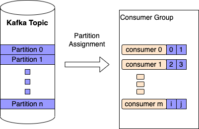

What is Arroyo for?
===================

Arroyo is a library for writing high-throughput, testable kafka
consumers and producers. This document attempts to outline the
intricacies of writing such consumers.

Goals
-----

1. Make it easy to build consumers that provide delivery guarantees
2. Make it easy to write high-throughput kafka consumers
3. Make it easy to write reliable, high throughput kafka producers
4. Abstract away rebalancing such that users of the library do not have
   to worry about it
5. Make it possible to test kafka consumer logic without having to
   reproduce the entire kafka environment
6. Provide a way for the application logic to signal backpressure

Why Simple Doesn’t Cut It
-------------------------

When visualizing event-driven architecture, Kafka is viewed as an
abstract queue with groups of producers pushing to it, and consumers
consuming from it (as in the diagram below).

.. mermaid::

   graph TD
       Producer --> Kafka_Topic
       Kafka_Topic --> Consumer
           Consumer --> Destination

A more accurate model is that kafka is like a log file which is
persistent and there are offsets of the file that different consumers
have read or not read.

The most simple kafka consumer looks something like this:

.. code:: python

   from confluent_kafka import Consumer

   conf = {
       "bootstrap.servers": "localhost:9092",
       "group.id": "my_group",
       "auto.offset.reset": "latest",
   }

   consumer = Consumer(conf)
   consumer.subscribe(["my_topic"])

   while True:
       message = consumer.poll()
       send_to_destination(process_message(message))

This simple consumer would not satisfy the goals mentioned at the top of
this page. The following subsections will explain why

Providing delivery guarantees
-----------------------------

By default, a consumer in the ``confluent_kafka`` library will
auto-commit on poll. To understand what it means to commit to a kafka
topic, see the Appendix. This can lead to the following issue:

.. code:: python

   # get message from kafka, commit immediately
   message = consumer.poll()
   # ❗❗❗ throws exception due to a network issue
   send_to_destination(process_message(message))
   # this message is now lost and we're on to the next one

This can be fixed by only committing after we know that the message has
reached its destination in the following way:

.. code:: python

   # add this value to the config:
   "enable.auto.commit": "false"
   # -------
   message = consumer.poll(timeout=0)
   send_to_destination(process_message(message))
   consumer.commit(message.offset())

High Throughput
---------------

The previous section has allowed us to not commit messages that are not
processed however committing every message severely hurts throughput.
Every call to commit is a network operation, it also makes the broker
persist and replicate the information. If we can reduce the number of
commit calls, our throughput can be much higher. And so we commit in
batches

.. code:: python

   # this code is purely descriptive.
   # We have to commit to each partition separately
   # but that code is not helpful for this example
   message = consumer.poll(timeout=0)
   batch.append(process_message(message))
   if len(batch) == batch_size:
       consumer.commit(offsets=[m.offset() for m in batch])

This will get us faster throughput however we are currently hand-waving
away how we send the message to its destination

Reliable High Throughput Batched Producers
------------------------------------------

Producing to Kafka reliably and at high throughput is not a simple
operation. Here is how a simple Kafka Producer looks in code:

.. code:: python

   from confluent_kafka import Producer

   conf = {
     "bootstrap.servers": "localhost:9092",
   }
   producer = Producer(conf)
   def send_to_destination(message):
       # ❗ This does not do what it says
       # it writes to a buffer
       producer.produce("destination_topic", message)
       # this will actually block until the messages are produced
       # calling this after produce every time is very expensive,
       # how often we flush has high impacts on the producer throughput
       producer.flush()

At a high level, the producer is actually buffering the messages
produced to the topic

.. image:: _static/diagrams/kafka_producer.png

A kafka producer writes to an internal buffer. This batches the IO
(good) but you don’t know when it will ever make it to the
destination

In order to allow for reliability of transmission, the
``confluent_kafka`` library provides `a callback to
produce <https://docs.confluent.io/platform/current/clients/confluent-kafka-python/html/index.html#confluent_kafka.Producer.produce>`__
like so

.. code:: python

   def delivery_callback(error, message):
       # do something here to make sure your message is in the state
       # you want it to be

   producer.produce("destination_topic", message, on_delivery=delivery_callback)

Dealing With Rebalancing
------------------------

What is Rebalancing
~~~~~~~~~~~~~~~~~~~

A kafka topic is divided into n partitions, each partition can be
consumed by exactly one consumer per `consumer
group <https://www.educba.com/kafka-consumer-group/>`__. A consumer can
consume multiple partitions

When Rebalancing Can Happen
~~~~~~~~~~~~~~~~~~~~~~~~~~~

Rebalancing can happen due to:

-  An addition or removal of a consumer to a consumer group

   -  (Every deploy does this)

-  A rebalance being kicked off manually
-  A consumer pod dies and now its partition needs to be re-assigned
-  Whenever the broker decides it’s a good idea (it can happen at any
   time)
-  TODO: More things?

How Rebalancing Affects a Consumer
~~~~~~~~~~~~~~~~~~~~~~~~~~~~~~~~~~

Rebalancing is annoying to handle for a consumer that processes batches,
imagine the following scenario:

.. mermaid::

   sequenceDiagram
       Broker->>Consumer: message
       activate Consumer
       note right of Consumer: start building batch
       Broker->>Consumer: message
       Broker->>Consumer: Revoke Partition
       deactivate Consumer
       Consumer->>Broker: commit batch
       note left of Broker: Received commit from revoked Consumer!

Once a partition is revoked for a consumer, it cannot commit to it. This
is bad news for the batch that the consumer has built up. Each consumer
has different requirements but a decision has to be made as to whether
to flush the batch or to discard its work and let the next consumer
assigned to this partition pick it up. The rebalancing behavior can be
customized by providing an ``on_revoke`` callback to the consumer when
subscribing.

.. code:: python

   from confluent_kafka import Consumer

   conf = {
       "bootstrap.servers": "localhost:9092",
       "group.id": "my_group",
       "auto.offset.reset": "latest",
   }

   def flush_current_batch(consumer, partitions):
       # flush the current batch
       pass

   consumer = Consumer(conf)
   consumer.subscribe(["my_topic"], on_revoke=flush_current_batch)

librdkafka’s Callback Hell
--------------------------

librdkafka uses callbacks as a core mechanic for control flow. A few
such examples have been mentioned in this document already. What is not
clear however, is that **callbacks are only called when ``poll`` is
called**

This means that:

-  this line could possibly do a lot of work:

.. code:: python

   # any scheduled callbacks will run within this call
   message = consumer.poll()

-  No callbacks will be invoked until the consumer or producer call
   ``poll`` again (for their respective callbacks)
-  ``poll`` has to be called periodically on a consumer otherwise the
   broker will kick the consumer out of the consumer group

   -  The handling of that revocation won’t happen until ``poll`` is
      called

Conclusion
----------

There are many intricacies and gotchas to writing high performant,
reliable kafka consumers. This document does not outline all of them but
all of what is outlined here should be kept in mind when designing any
kafka consumer library.

Appendix
--------

Committing to a Kafka Topic
---------------------------

A consumer comitting to a topic signals to the broker that this message
has been processed. When ``poll`` is called next by that consumer, it
will return the next message.

`API
Doc <https://docs.confluent.io/platform/current/clients/confluent-kafka-python/html/index.html#confluent_kafka.Consumer.commit>`__

What is a Kafka Consumer Group
------------------------------

https://www.educba.com/kafka-consumer-group/
